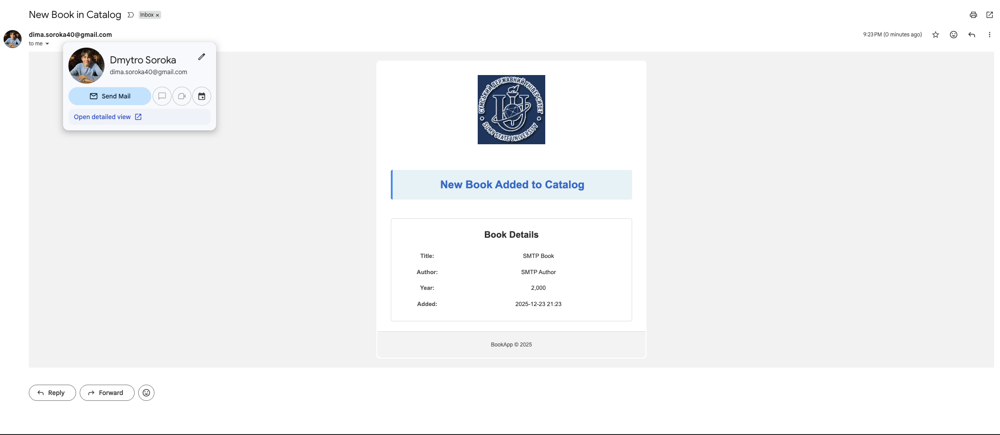

# Spring Boot Books Application

## Lab 7 - FreeMarker Templating and Email Integration in Spring MVC

This project demonstrates server-side templating in Spring MVC using both Thymeleaf (for web pages) and FreeMarker (for email templates), showcasing HTML email generation with Gmail SMTP integration.

**Important**: In this project, **Thymeleaf templates remain unchanged for web pages**, while **FreeMarker is applied exclusively for email templates**.

## Overview

A web application for managing a catalog of books and comments. When a new book is added, an HTML email notification is automatically sent using FreeMarker templates.

## Technologies

- **Java**: 17
- **Spring Boot**: 3.2.0
- **Thymeleaf**: Server-side templating for HTML web pages
- **FreeMarker**: Server-side templating for email templates
- **Spring Mail**: Email sending via JavaMailSender
- **Gmail SMTP**: Email delivery service
- **H2 Database**: File-based database

## Project Structure

```
src/main/java/sumdu/edu/ua/
├── config/
│   └── EmailFreemarkerConfig.java    # FreeMarker config for email templates
└── web/
    ├── controller/
    │   └── BooksController.java      # Calls MailService.sendNewBookEmail()
    └── service/
        ├── EmailTemplateProcessor.java  # Processes .ftl templates
        └── MailService.java            # Sends HTML emails via Gmail SMTP

src/main/resources/
├── templates/                    # Thymeleaf HTML templates (web pages)
└── mail-templates/               # FreeMarker email templates (.ftl)
    └── new_book.ftl              # New book notification email
```

## Configuration

### Dependencies (pom.xml)

```xml
<dependency>
    <groupId>org.springframework.boot</groupId>
    <artifactId>spring-boot-starter-freemarker</artifactId>
</dependency>

<dependency>
    <groupId>org.springframework.boot</groupId>
    <artifactId>spring-boot-starter-mail</artifactId>
</dependency>
```

### application.properties

```properties
# Mail configuration (Gmail SMTP)
spring.mail.host=smtp.gmail.com
spring.mail.port=587
spring.mail.username=YOUR_GMAIL_LOGIN
spring.mail.password=YOUR_16_CHARACTER_APP_PASSWORD
spring.mail.properties.mail.smtp.auth=true
spring.mail.properties.mail.smtp.starttls.enable=true
spring.mail.default-encoding=UTF-8
```

**Note**: To use Gmail SMTP:

1. Enable 2-factor authentication on your Google account
2. Generate an App Password (Security → App Passwords)
3. Replace credentials in `application.properties`

## Email Service Implementation

### EmailFreemarkerConfig

Separate FreeMarker configuration for email templates:

```java
@Configuration
public class EmailFreemarkerConfig {
    @Bean
    @Qualifier("emailFreemarkerConfig")
    public Configuration freemarkerEmailConfig() {
        Configuration cfg = new Configuration(Configuration.VERSION_2_3_32);
        cfg.setClassLoaderForTemplateLoading(
            getClass().getClassLoader(),
            "/mail-templates/"
        );
        cfg.setDefaultEncoding("UTF-8");
        return cfg;
    }
}
```

### EmailTemplateProcessor

Processes FreeMarker email templates:

```java
@Component
public class EmailTemplateProcessor {
    private final Configuration cfg;

    public EmailTemplateProcessor(@Qualifier("emailFreemarkerConfig") Configuration cfg) {
        this.cfg = cfg;
    }

    public String process(String templateName, Map<String, Object> model) {
        Template template = cfg.getTemplate(templateName);
        StringWriter writer = new StringWriter();
        template.process(model, writer);
        return writer.toString();
    }
}
```

### MailService

Sends HTML emails via Gmail SMTP:

```java
@Service
public class MailService {
    public void sendNewBookEmail(Book book) {
        Map<String, Object> model = new HashMap<>();
        model.put("title", book.getTitle());
        model.put("author", book.getAuthor());
        model.put("year", book.getPubYear());
        model.put("added", LocalDateTime.now().format(
            DateTimeFormatter.ofPattern("yyyy-MM-dd HH:mm")));

        String html = templateProcessor.process("new_book.ftl", model);

        MimeMessage message = mailSender.createMimeMessage();
        MimeMessageHelper helper = new MimeMessageHelper(message, true);
        helper.setTo("recipient@gmail.com");
        helper.setSubject("New Book in Catalog");
        helper.setText(html, true);
        helper.setFrom("bookapp@erlkonig.sumdu.edu.ua");

        mailSender.send(message);
    }
}
```

**Integration Flow**:

1. User submits book form → `BooksController.addBook()`
2. Book is saved via `BookService`
3. `MailService.sendNewBookEmail()` is called
4. Email template is processed with book data
5. HTML email is sent via Gmail SMTP

## Email Template (new_book.ftl)

**Location**: `src/main/resources/mail-templates/new_book.ftl`

**Features**:

- **Dynamic variables**: `${title}`, `${author}`, `${year}`, `${added}`
- **Conditional rendering**: `<#if year?int < 2000>...</#if>` for rare editions
- **External logo**: Loaded from GitHub raw URL
- **Date formatting**: Pre-formatted in `MailService` (yyyy-MM-dd HH:mm)
- **Custom footer**: "BookApp © 2025"
- **Styled message panel**: Background color, border, padding
- **Email-friendly HTML**: Table-based layout with inline CSS

**Example**:

```ftl


<div style="background-color: #e8f4f8; border-left: 4px solid #2196F3;">
    <h1>New Book Added to Catalog</h1>
</div>

<table>
    <tr><td>Title:</td><td>${title}</td></tr>
    <tr><td>Author:</td><td>${author}</td></tr>
    <tr><td>Year:</td><td>${year}</td></tr>
    <tr><td>Added:</td><td>${added}</td></tr>
</table>

<#if year?int < 2000>
<p style="color: #a36b00; font-weight: bold;"><b>Rare Edition!</b></p>
</#if>

<p>BookApp © 2025</p>
```

## Screenshots

### Email Notification



The email demonstrates:

- Logo from GitHub URL
- Styled message panel
- Book details table
- Conditional "Rare Edition!" badge for books published before 2000
- Custom footer

## Running the Application

```bash
mvn spring-boot:run
```

**Endpoints**:

- `GET /books` - List books
- `GET /books/add` - Show add book form
- `POST /books/add` - Create book (triggers email notification)
- `GET /books/{id}` - Show book with comments

## FreeMarker vs Thymeleaf

**FreeMarker** (used for emails):

- Traditional template syntax: `${variable}`, `<#if>`, `<#list>`
- Programmatic processing with `Template.process()`
- Requires manual configuration for separate template paths
- Excellent for email templates

**Thymeleaf** (used for web pages):

- Natural templates with `th:` attributes
- Automatic Spring Boot integration
- Better for web pages with HTML5 support
- Strong Spring MVC integration

This hybrid approach leverages each engine's strengths: Thymeleaf for web pages, FreeMarker for email templates.
